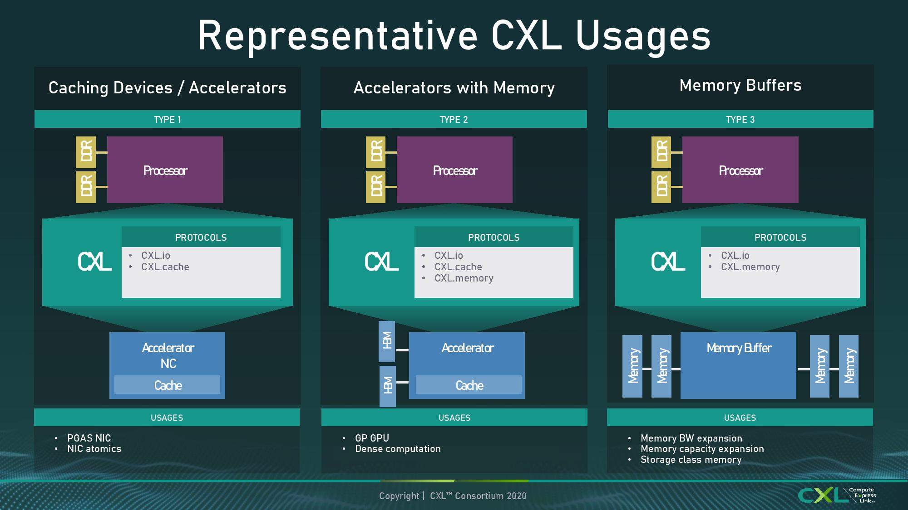
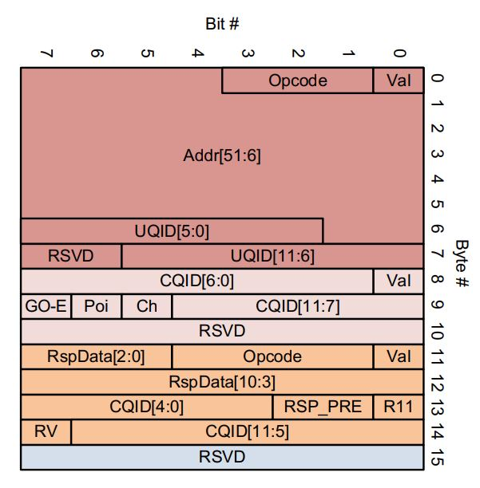
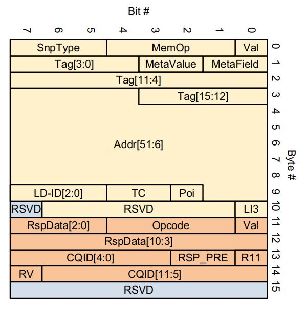
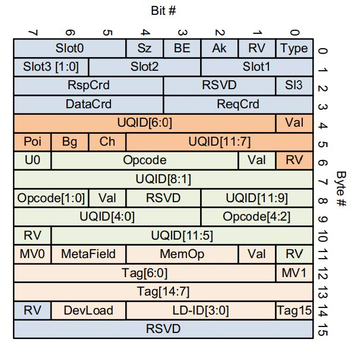

# pyCXL

This project attempts to create a **pure python interface** for a CXL environment as a standalone pluggin.

It is a work in progress. The current work reflects [CXL 2.0](https://www.computeexpresslink.org/download-the-specification).

---
TODO: Installation Notes

---
## What is CLX?

[CXL](https://www.computeexpresslink.org/about-cxl) is an industry-supported Cache-Coherent Interconnect for Processors,
Memory Expansion and Accelerators and designed as an industry **open standard** interface for high-speed
communications.

## How do I use this package?
This package is a work in progress and I do not claim to be a CXL expert. I started this project as a way to help myself
learn the protocol.

The overall scope and design of this project is to get to a place where commands can be issued and responses read from a
a device that supports the CXL protocol. This package does not implement the CXL protocol at a firmware level on the 
drive.

---
TODO: Example of command and response with the package

---

## What is the CXL Protocol?

The CXL protocol actually refers to three separate protocols which are used in various combinations based on the type
of device setup.

* CXL.cache
* CXL.io
* CXL.mem

These three protocols behave differently and interact with eachother, but they communicate with a common data format 
called a "Flit".

## What's a Flit?

A Flit is a highly compact and highly mutable 16 byte structure which itself contains combinations of _sub_-structs.
These flits pose a significant design challenge as the substructs contained within may not be byte-aligned. **Substructs
are not gaurenteed to start or end on an 8 bit byte boundary.** 

Below are several examples of these Flits:

### The Good Flit

This Flit contains three substructs which have been color-coded Red[0:63], 
Pink[64:87], Orange[88:119], and 8 bits of RSVD at the
end in Light Blue[120:127]. I call this the "good" flit because it can be easily 
defined using builtin ctypes. All substructs begin and end on byte boundaries.

### The Less-Good Flit

This flit contains two substructs, and at a glance, shares many similarities wit the good flit. There's a nuggest of
RSVD at byte 10, but this bit actually helps to keep the 
Yellow struct byte aligned. No, the trouble here is with representing the
Yellow substruct at all. It's 87 bits long with a giant contiguous field in the middle
which actually crosses over the 64 bit boundary. You can't actually split it into 3 c_uint8 because the 
Tag field extends into the Addr field. One way to
solve this might be to use 2 c_uint8's then combine the Tag and 
Addr fields into a single c_uint64 - but then that would split the 
LD-ID field in half. 

It's not unsolvable, it's just why this flit is the "less good" flit.

### The Inconvenient Flit

Right away thre are several challenges with this flit. Only the first 
Light Blue[0:31] struct begins and ends on a byte boundary. 
Orange[32:56] begins on a byte addressable location, but does not end on one as it is
17 bits. Light Green[49:88] is actually 2 structs in a row - neither one begins 
nor ends at a byte addressable location. The first is from [49:68] and the second is from [69:88]. The final struct 
Pink[89:118] has the same issue. 

Because each field must be uniquely identifiable, this flit needs some way to differentiate between the first or second 
substruct. So ideally, having a ctypes array of size 20 bit elements would be the way to go here. Add that to the list
of challenges. Further, because these substructs are reused in other flits, it's necessary for them to be atomically 
defined. If a substruct were ever updated or changed, you would want to make that change in one place in the code rather
than modifying everywhere the struct was hardcoded.

### The Jerk Flit

The Jerk Flit is a **nightmare design from a true sadist**. The checkered Red[32:59] is 
interrupted by the Yellow[60:89] struct. I say "interrupted" because the final field 
of the Red struct, DevLoad*, appears _AFTER_ the Yellow
struct has finished.

Both the Red and the Yellow struct are actually **the 
same struct!**

This should be a ctypes array of the same struct twice. Only . . . one of the fields has been arbitrarily misplaced. 
Additionally, because these substructs are reused throughout the protocol, it's important that they are atomically 
defined, but at least in this instance, that atomic definition must include the possibility that fields within the 
struct are not contiguous with itself. 